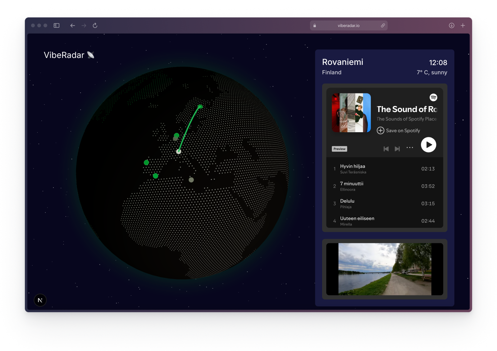
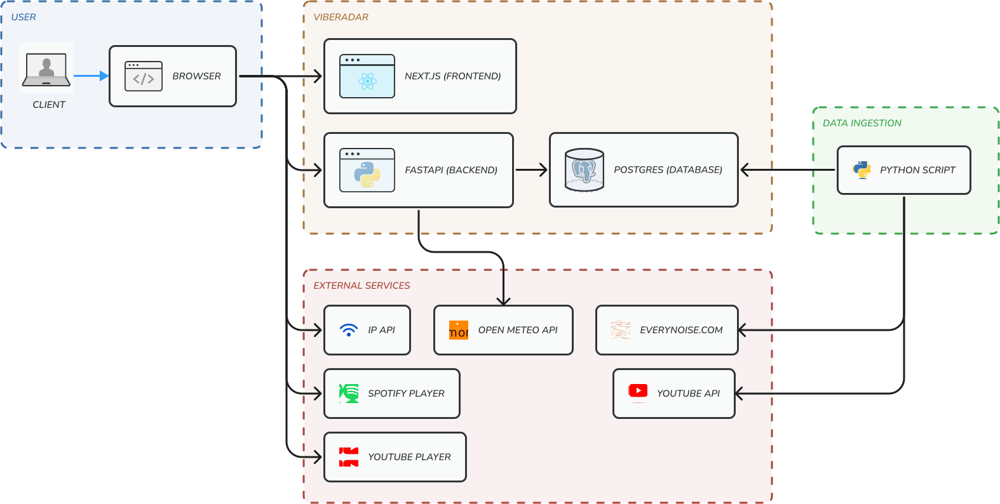
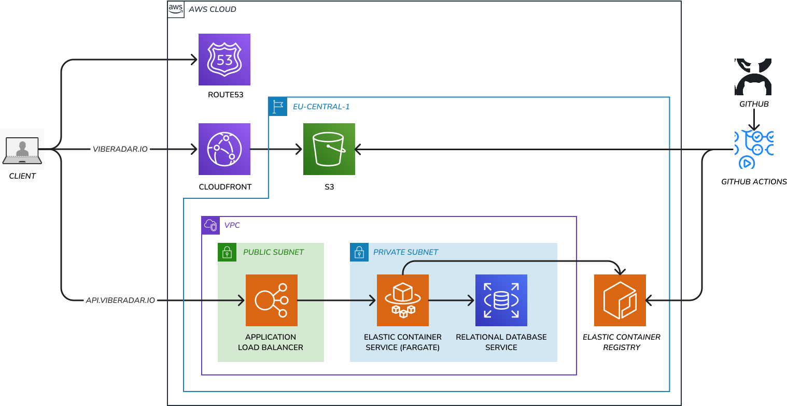

# VibeRadar

**VibeRadar** is a website where you can click on a map to find out the vibe of a location.<br>
Available vibes currently include:
- **Music** (Spotify Playlist)
- **Street atmosphere** (YouTube Video)

> Try it out at [viberadar.io](https://viberadar.io/)



## Tech Stack

- **Frontend**: Typescript, Next.js (React), Tailwind CSS, three-globe
- **Backend**: Python, FastAPI, PostgreSQL
- **Deployment**: Terraform, AWS (S3, CloudFront, ECS, RDS), GitHub Actions
- **Data**: Everynoise.com, Spotify, YouTube, Open-Meteo, ipapi

## Architecture



VibeRadar is designed as a web application consisting of a frontend and a backend.
The client accesses the application via a web browser, which serves the interactive 3D globe interface.
The frontend communicates with a FastAPI backend that provides RESTful APIs for data retrieval.
The backend interacts with a PostgreSQL database to fetch the "vibe" information.
Data ingestion into the database is done on demand through a manually ran Python script.
Various data sources from external services are integrated to provide the necessary information.

## Local Development

### Prerequisites

Make sure you have the following installed:

- Docker & Docker Compose
- Node.js

### Backend

Start the backend by running the following command in the `backend` directory:

```bash
docker-compose up --build
```

This will start the FastAPI server and the PostgreSQL database. On the first run, it will also create and seed the necessary tables.<br>
The backend will be available at http://localhost:8008.

### Frontend

In a separate terminal, navigate to the `frontend` directory and run:

```bash
npm install
npm run dev
```
This will start the Next.js development server.<br>
The frontend will be available at http://localhost:3000.

## Deployment

When adding new commits to the main branch of this repo, the deployment will be triggered automatically via GitHub Actions.

In order to deploy the infrastructure from scratch into a new AWS account, do the following:

1. Create a new AWS account and set up your credentials locally.
2. Navigate to the `terraform/state-backend` directory and create a new S3 bucket for the Terraform state. by running the following commands:
```bash
terraform init
terraform apply
```
3. Navigate into the `terraform` directory, copy the name of the state bucket from the previous step and paste it into the `main.tf` file.
4. Run the following commands in the `terraform` directory to deploy the infrastructure:
```bash
terraform init
terraform apply
```
5. Make sure to adapt variables in the `terraform/variables.tf` file to your needs. Make sure to also set up register your custom domain for it to work as is.

This should result in the following setup on AWS:



**Frontend:** Next.js app statically hosted on S3, served via CloudFront with custom domain and HTTPS

**Backend**: FastAPI app containerized, deployed on ECS Fargate (in private subnet) behind an ALB with custom domain and HTTPS

**Database**: PostgreSQL on RDS, in private subnet, accessible only by the ECS container
